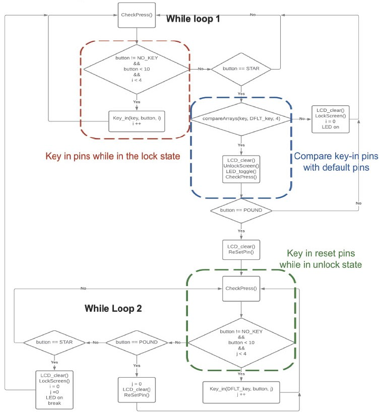
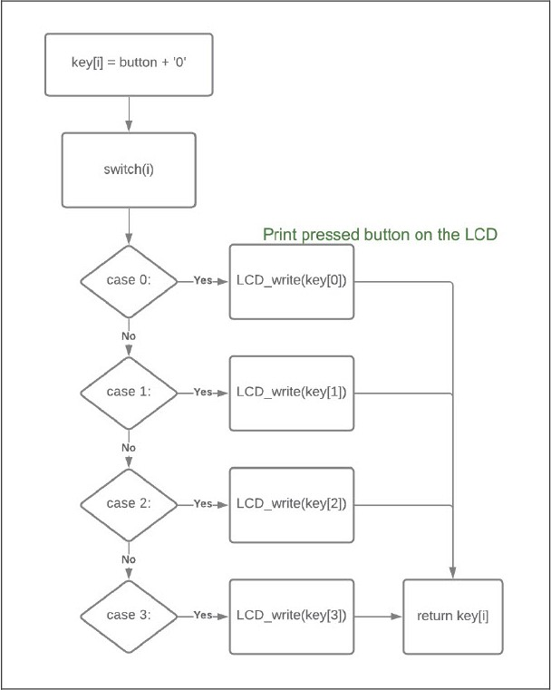

# Software Architecture
There are two while loops in the software architecture, I label them as while loop 1 and while loop 2. The purpose of both while loops is to continuously detect the status of the keypad(pressed or released) and repeatedly check each condition.  
The software architecture can mainly separate into two parts, one is the lock state, and another is the unlock state. The region within the red box shown in the picture below is the sector that shows how the pins are being entered while in the lock state. The region within the blue sector is the sector that compares the pins we key in and the default keys, if two sets of pins align with each other then the lockbox system will be unlocked. 
After unlocking the lockbox, the software architecture comes to the second while loop. The green sector within this while loop offers the function of resetting the default pins and relocking the system after resetting the pins. 
The details and further information can be shown in the following figures, which include the flowcharts of the lockbox system and the functions that have been utilized while designing the software architecture of this system. 
* main():

  

* CheckPress():

  

* Key_in():

  

* CompareArrays():

  

