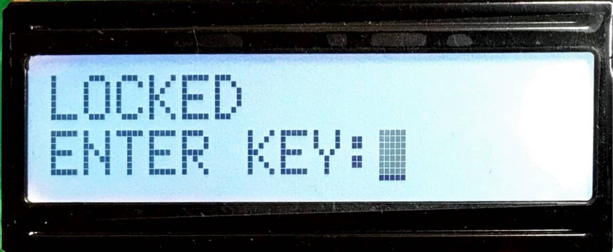
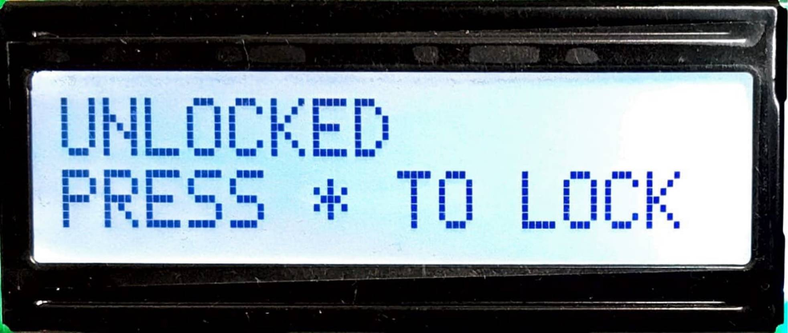
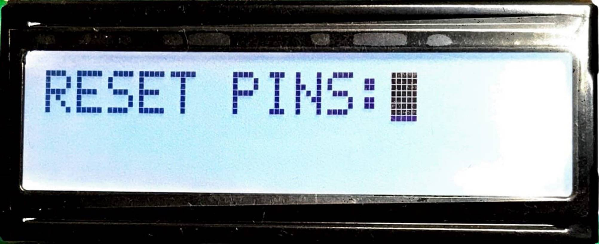

# Digital-Lockbox

# Project Introduction
This project aims to design a digital lockbox by integrating an LCD module, a 4 X 4 keyboard, and the MCU STM32L476. The lockbox has the following three main functions (states), locked state, unlocked state, and reset pin state. As long as the lockbox system is powered on, the LCD module will initially display the locked state. In the locked state, we can enter 4 pins from 0 to 9 into the LCD screen by pressing the button on the 4 X 4 keyboard. After entering the pin, we can compare the pin with the default pin by pressing the STAR button. If the pin we input is correct, then it will enter the unlocked state. If the pin is incorrect, the LCD will clear what we have entered and remain locked until we enter the correct pin. 
After entering the unlocked state, we can press the STAR key again to re-lock, or press the POUND key to modify the default pin. Same as the locked state, the pins are limited to 4 pins. In case of accidentally resetting the pins by mistake, we can modify the pins at any time when resetting the pins. After resetting the pin, we can press the STAR button to confirm the reset pin and return to the locked state. 

# System Specification
* LCD Module:  
It can be seen from the below specifications of the LCD module that the size of the LCD monitor we used for the lockbox is sufficient, and the color contrast is very good. It can not only display the instructions clearly but also have enough space to key in the pins. The power requirement is 3.3V, which is basically very low, so we can use a very small power supply to drive the LCD.  

<!-- <table >
  <tr>
    <td>Screen Size:</td>
    <td>55mm(width), 15mm(hight)</td>
  </tr>
  <tr>
    <td>Display Size:</td>
    <td>2 lines x 16 characters</td>
  </tr>
  <tr>
    <td>Backlight:</td>
    <td>White</td>
  </tr>
  <tr>
    <td>Power Supply:</td>
    <td>3.3V</td>
  </tr>
  <tr>
    <td>Driver IC:</td>
    <td>ST7066U 8/4-bit MPU interface</td>
  </tr>
  <tr>
    <td colspan="2">State Instructions</td>
  </tr>
</table> -->

| Screen Size: | 55mm(width), 15mm(hight)|
| :-----------:  | :-----------: |
| Screen Size: |55mm(width), 15mm(hight)|
| Display Size: | 2 lines x 16 characters |
| Backlight: |White|
| Power Supply: | 3.3V |
| Driver IC: | ST7066U 8/4-bit MPU interface |

|  |  |  |
| :-----------:  | :-----------: |:-----------: |
| Figure 1. Lock Sate | Figure 2. Unlock State | Figure 3. Reset PINs |
