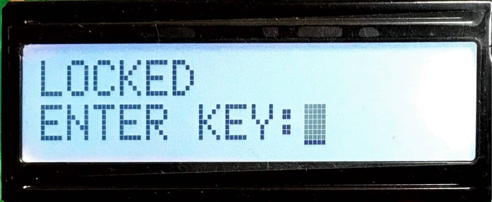
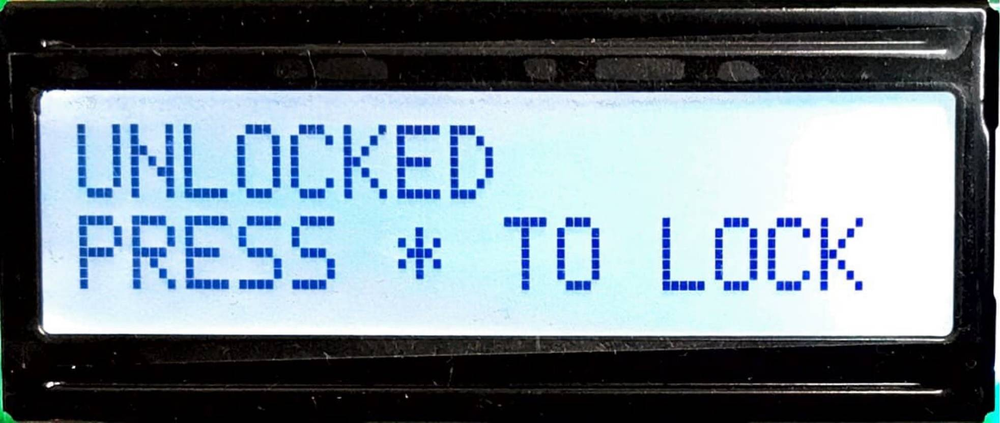
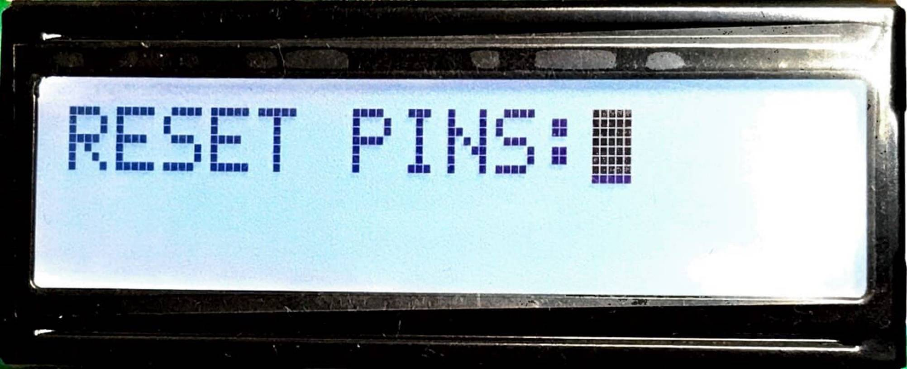
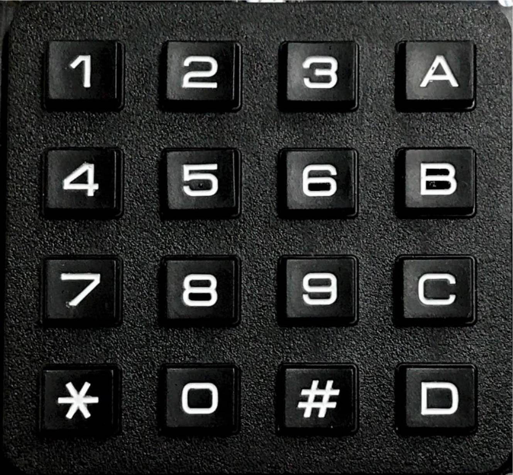
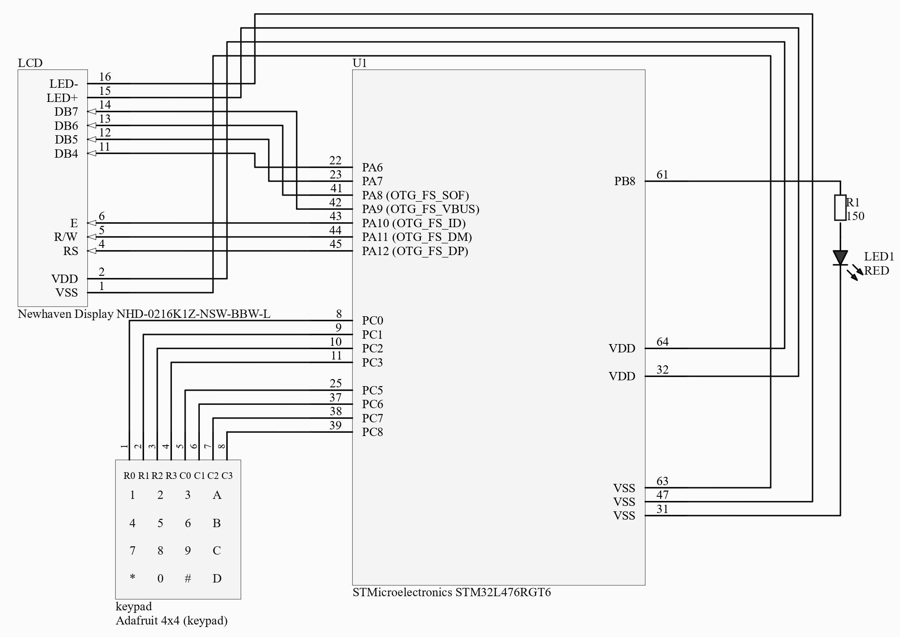
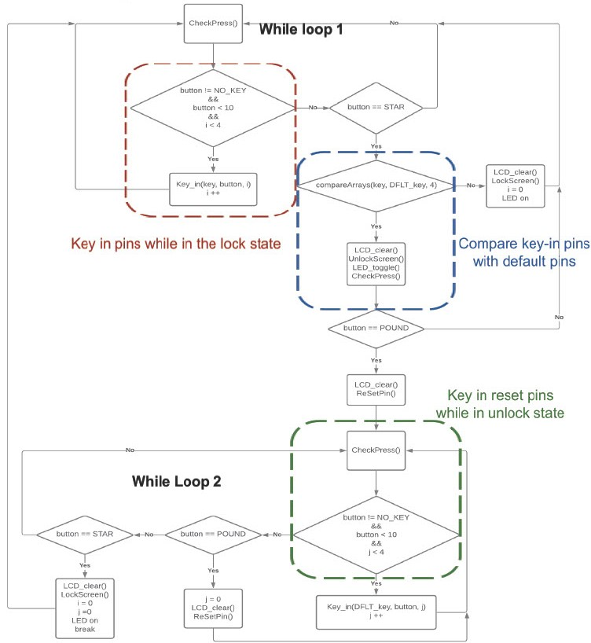
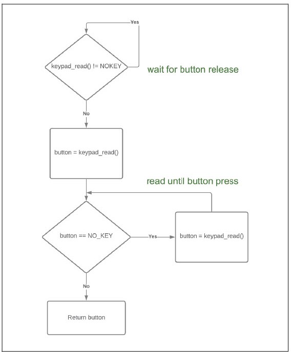
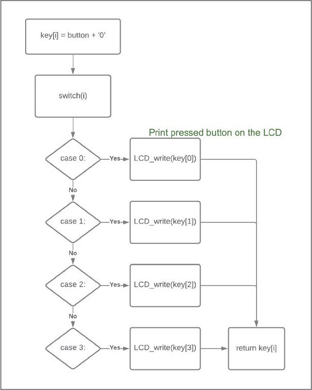
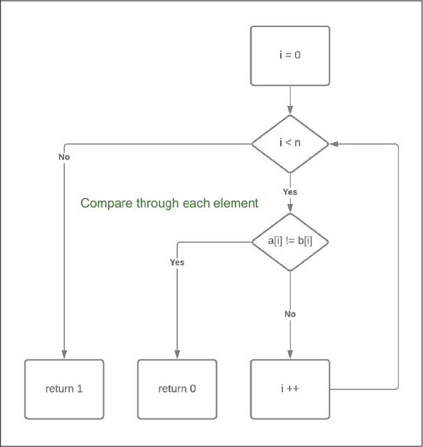

# Digital-Lockbox

# Project Introduction
This project aims to design a digital lockbox by integrating an LCD module, a 4 X 4 keyboard, and the MCU STM32L476. The lockbox has the following three main functions (states), locked state, unlocked state, and reset pin state. As long as the lockbox system is powered on, the LCD module will initially display the locked state. In the locked state, we can enter 4 pins from 0 to 9 into the LCD screen by pressing the button on the 4 X 4 keyboard. After entering the pin, we can compare the pin with the default pin by pressing the STAR button. If the pin we input is correct, then it will enter the unlocked state. If the pin is incorrect, the LCD will clear what we have entered and remain locked until we enter the correct pin. 
After entering the unlocked state, we can press the STAR key again to re-lock, or press the POUND key to modify the default pin. Same as the locked state, the pins are limited to 4 pins. In case of accidentally resetting the pins by mistake, we can modify the pins at any time when resetting the pins. After resetting the pin, we can press the STAR button to confirm the reset pin and return to the locked state. 

# Table of Contents
* [System Specification](#system-specification)
* [Schematic](#schematic)
* [How the code works?](https://github.com/ElvisTang123/Multimeter/blob/main/Program%20Files/README.md)

# System Specification
* LCD Module:  
It can be seen from the below specifications of the LCD module that the size of the LCD monitor we used for the lockbox is sufficient, and the color contrast is very good. It can not only display the instructions clearly but also have enough space to key in the pins. The power requirement is 3.3V, which is basically very low, so we can use a very small power supply to drive the LCD.  

| Screen Size: | 55mm(width), 15mm(hight)|
| :-----------:  | :-----------: |
| Display Size: | 2 lines x 16 characters |
| Backlight: |White|
| Power Supply: | 3.3V |
| Driver IC: | ST7066U 8/4-bit MPU interface |

|  |  |  |
| :-----------:  | :-----------: |:-----------: |
| Figure 1. Lock Sate | Figure 2. Unlock State | Figure 3. Reset PINs |

* Keypad:  
It can be seen from the below specifications of the keypad that the force we are required to press is really soft, therefore it is easier and more convenient to use. Furthermore, the contact resistance is less than 100Ω, which means it won’t cause huge energy consumption.  

| Product Dimensions: | 69.0mm x 65.5mm x 9.7mm |
| :-----------:  | :-----------: |
| Key Amount: |4 X 4(16 keys)|
|Force:| 160-180g |
| Contact Resistance: | <100Ω |

|  |
| :-----------:  | 
| Figure 4. Adafruit 4 X 4 Keypad |

# Schematic

  

# Software Architecture
There are two while loops in the software architecture, I label them as while loop 1 and while loop 2. The purpose of both while loops is to continuously detect the status of the keypad(pressed or released) and repeatedly check each condition.  
The software architecture can mainly separate into two parts, one is the lock state, and another is the unlock state. The region within the red box shown in the picture below is the sector that shows how the pins are being entered while in the lock state. The region within the blue sector is the sector that compares the pins we key in and the default keys, if two sets of pins align with each other then the lockbox system will be unlocked. 
After unlocking the lockbox, the software architecture comes to the second while loop. The green sector within this while loop offers the function of resetting the default pins and relocking the system after resetting the pins. 
The details and further information can be shown in the following figures, which include the flowcharts of the lockbox system and the functions that have been utilized while designing the software architecture of this system. 
* main():

  

* CheckPress():

  

* Key_in():

  

* CompareArrays():

  

# Demonstration
